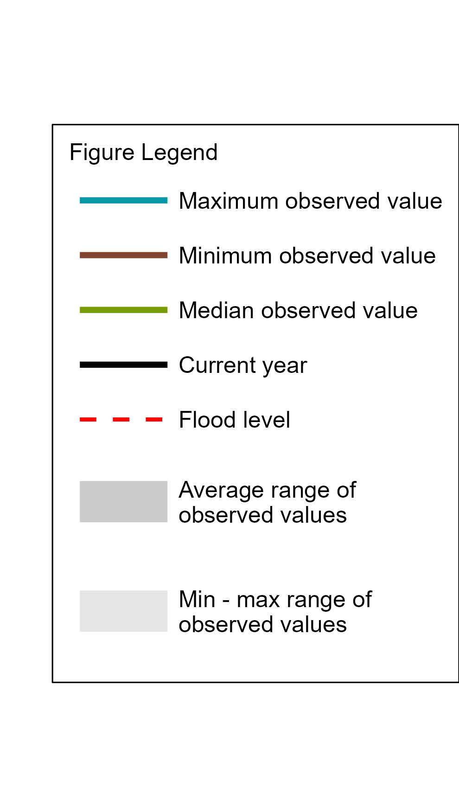

```{r setup, include=FALSE}
# snowBulletin(year = 2024, month = 3, scale = 1, basins = c("Upper Yukon", "Teslin", "Central Yukon", "Pelly", "Stewart", "White", "Lower Yukon", "Porcupine", "Peel", "Liard", "Alsek"), save_path = "C:/Users/estewart/Documents/R/Projects/YGwater", synchronize=FALSE, language="english")
knitr::opts_chunk$set(echo = TRUE, warning = FALSE, message = FALSE, dpi=300)
con <- YGwater::hydrometConnect()
knitr::include_graphics
fig.height_half <- 2.9
fig.height_full <- 2.7
language_param <- params$language
year_param <- params$year
month_param <- params$month
scale_param <- params$scale

```

```{r Functions, echo=FALSE}
#### -------------------- A: snow scale/pillow plots ---------------------- ####
snowbullpillow <- function(location, custom_title, year, number="", language="en", scale=scale_param) {
  
  plot <- YGwater::hydrometContinuous(
  location = location,
  parameter = "SWE",
  startDay = paste0(year, "-09-01"),
  endDay = paste0(year, '-07-01'),
  years = year-1,
  returns = "none",
  custom_title = custom_title,
  con = con,
  plot_scale = scale, 
  snowbulletin = TRUE, 
  language = language
)
plot <- plot + ggplot2::theme(legend.position = "none")

# if(language == "french") {
#   plot <- plot + ggplot2::labs(y="EEN (mm)")
# }

return(plot)

}

#### ------------- B: Function to create basin SWE boxplots --------------- ####
snowbullSWE <- function(loc, basin, year, swe_basins, custom_title, scale=scale_param) {
  # Subset data
  swe_basin <- swe_basins[swe_basins$location==basin,]
  swe_basin$datetime <- as.POSIXct(swe_basin$datetime)
  # Plot
  plot <- hydrometDiscrete(location = loc, parameter = "SWE", startDay = 1, tzone = "MST", years = c(year), title = TRUE, custom_title = custom_title, plot_type = "linedbox", save_path = NULL, discrete_data = swe_basin, con = con, plot_scale = scale)
  
  plot <- plot + ggplot2::theme(legend.position = "none")
  
  if(language == "french") {
  plot <- plot + ggplot2::labs(y="EEN (mm)")
  }
  
  return(plot)
}

#### ------------- C: Function to create monthly precip plots ------------- ####
snowBullPrecip <- function(tsid, year, scale=scale_param, custom_title, language, month = month_param) {
  tab <- DBI::dbGetQuery(con, paste0("SELECT * FROM measurements_continuous WHERE timeseries_id = ", tsid,
                                     " AND datetime >= '", year-40, "-10-01'"))
  attr(tab$datetime, "tzone") <- "MST"
  tab$month <- format(tab$datetime, "%m")
  tab$year <- format(tab$datetime, "%Y")
  tab$units <- "mm"
  
  if (language=="french") {
    custom_title <- paste0("C : Précipitations mensuelles à ", custom_title)
  } else {
    custom_title <- paste0("C: ", custom_title, " Monthly Precipitation")
  }

  plot <- hydrometDiscrete(location = NULL, parameter = "Total precipitation",
                 tzone = "MST",
                 years = year-1,#c(params$year),
                 startDay = "2023-10-01", # 275
                 endDay = "2024-05-01", #120
                 title = TRUE, custom_title = custom_title,
                 plot_type = "linedbox", plot_scale = scale,
                 save_path = NULL, discrete_data = tab, con = con)
  plot <- plot + ggplot2::theme(legend.position = "none")
  
    if(language == "french") {
  plot <- plot + ggplot2::labs(y="Précipitations (mm)")
}

  # Calculate stats (% above/below median of cumulative winter precip)
  # Cumulative median / value on date
  stats_c <- round(sum(plot$plot_env$discrete[plot$plot_env$discrete$month <= month | 
                                            plot$plot_env$discrete$month >= 10, ]$value) /
                   sum(plot$plot_env$stats_discrete[plot$plot_env$stats_discrete$type == "median" &
                                            (plot$plot_env$stats_discrete$month <= month | 
                                            plot$plot_env$stats_discrete$month >= 10), ]$value) * 100)
  return(list(plot, stats_c))
}

#### --------------- D: Functions to create CDDF plots -------------------- ####
# Function for calculating CDDF
getCDDF <- function(temps, year) {

  # Function for calculating cddf of dataframe (with all dates of interest)
calcCDDF <- function(temps) {
  cddf <- 0
  temps$cddf <- NA
  for (d in 1:length(temps$value)) {
    t <- temps$value[d]
    # If temperature is NA
    if (is.na(t)) {
      t <- 0
    }
    # If yesterday's cddf is 0 and todays temp is >= 0, keep cddf at 0
    if (cddf==0 & t>=0) {
      cddf <- 0
    } else { 
      cddf <- cddf - t
      if (cddf<0){cddf <- 0}}
    # Set cddf for that day
    temps$cddf[d] <- cddf
  }
return(temps)
} 


# Keep only sept-june data
temps <- temps[format(temps$datetime, "%m") %in% c("09", "10", "11", "12", "01", "02", "03", "04", "05", "06"),]

# Find first and last year 
first_yr <- format(min(temps$datetime), "%Y")
last_yr <- format(max(temps$datetime), "%Y")

# if (last_yr <= year) {
#   last_yr <- year 
# }

cddf <- data.frame()
# Run over every year
for (y in first_yr:last_yr) {
  # Subset data
    tab <- temps[temps$datetime >= paste0(y, '-09-01') 
                 & temps$datetime < paste0(y+1, '-06-14'),]
  # Only calculate if missing less than 10 days, but only for years that are not in the 'years' list
    if (length(tab$datetime) != 0) {
      if (sum(!is.na(tab$value)) >= 276 | format(min(tab$datetime), "%Y") %in% c(year-1)) {
      cddf_y <- calcCDDF(tab)
      cddf <- rbind(cddf, cddf_y)
    }
    }
}

# Rename columns and remove temp
cddf <- cddf[,c("datetime", "cddf")]
colnames(cddf) <- c("datetime", "value")

return(cddf)
}

# Function to create CDDF plots
snowbullCDDF <- function(timeseries_id, custom_title, language="en", 
                         year=year_param, month=month_param, scale=scale_param) {
  location <- DBI::dbGetQuery(con, paste0("SELECT datetime, value FROM measurements_continuous WHERE timeseries_id = ", timeseries_id))

  location <- getCDDF(location, year)
  
  # Set title based on language
  if (language=="fr") {
    custom_title <- paste0("D : Degrés-jours de gel cumulés à ", custom_title)
  } else {
    custom_title <- paste0("D: Cumulative Degree-Days of Freezing in ", custom_title)
  }

  plot <- YGwater::hydrometContinuous(parameter= "CDDF", 
                                      startDay = "2023-09-01", 
                                      endDay = "2024-08-31",  
                                      years = c(year-1), 
                                      title = TRUE, 
                                      custom_title = custom_title, 
                                      returns = "none", 
                                      allowed_missing = 10, 
                                      plot_scale = scale, 
                                      save_path = NULL, 
                                      con = con, 
                                      continuous_data = location, 
                                      snowbulletin = TRUE,
                                      language = language)
  plot <- plot + ggplot2::theme(legend.position = "none") 
  
    if(language == "fr") {
      plot <- plot + ggplot2::labs(y="DJGC (\u00B0C-jours)")
    } else {
      plot <- plot + ggplot2::labs(y="CDDF (\u00B0C days)")
      }

  
  stats_d <- plot$data[plot$data$datetime == paste0(year, "-0", month, "-01"),]
  #stats_d <- plot$data[plot$data$datetime == paste0(2024, "-0", 2, "-28"),]
  stats_d <- c(round(stats_d$value / stats_d$md *100), round(stats_d$value))
    
  return(list(plot, stats_d))
}

#### --------- E: Function to create lake level snow bulletin plots ------- ####
snowbullWater <- function(location, parameter, year, custom_title, scale, language="en") {
  flood <- data$flow_level_flood
  tryCatch({
  plot <-
    YGwater::hydrometContinuous(
      location = location,
      parameter = parameter,
      startDay = paste0(year, "-10-01"),
      endDay = paste0(as.character(as.numeric(year) + 1), '-09-30'),
      years = year,
      returns = "none",
      custom_title = custom_title,
      con = con,
      plot_scale = scale * 0.9,
      snowbulletin = TRUE,
      language = language
    )
  
  # if (params$language == "french") {
  #   plot <- plot + 
  #   ggplot2::scale_x_datetime(date_breaks = waiver(), labels = labs, expand = c(0,0))
  # }
  
  #plot <- plot + ggplot2::geom_line(ggplot2::aes(y=zoo::rollmean(max,5, fill=NA)), colour = "#0097A9", size=1) +
   # ggplot2::geom_line(ggplot2::aes(y=zoo::rollmean(min,5, fill=NA)), colour = "#834333", size=1)
  
  if (exists('flood') &
      !is.null(flood) & parameter %in% c("water level", "water flow")) {
    if (parameter == "water level") {
      plot <- plot +
        ggplot2::geom_hline(
          yintercept = dplyr::filter(flood, ID == location)$Flood_level_asl,
          linetype = "dashed",
          color = "red",
          size = 1
        ) # +
        # ggplot2::annotate(
        #   "text",
        #   x = as.POSIXct(paste0(year+1, "-03-25")),
        #   y = dplyr::filter(flood, ID == location)$Flood_level_asl, #+ (max(plot$data$max)-min(plot$data$min))/20,
        #   label = "Flood level",
        #   colour = "red",
        #   vjust = -0.5
        # )
             if(language == "fr") {
      plot <- plot + ggplot2::labs(y="Niveau d'eau (m)")
      } 
      
    } else {
      plot <- plot +
        ggplot2::geom_hline(
          yintercept = dplyr::filter(flood, ID == location)$Flood_flow,
          linetype = "dashed",
          color = "red",
          size = 1
        ) +
        # ggplot2::annotate(
        #   "text",
        #   x = as.POSIXct(paste0(year+1, "-03-25")),
        #   y = dplyr::filter(flood, ID == location)$Flood_flow,  #+ (max(plot$data$max)-min(plot$data$min)),
        #   label = "Flood level",
        #   colour = "red",
        #   vjust = -0.5
        #   ) + 
        ggplot2::scale_y_log10() 
      
      if(language == "fr") {
      plot <- plot + ggplot2::labs(y="Débit (m3/s)")
      } 
    }
    
  } else {
    plot <- plot
  }
  
  plot <- plot + ggplot2::theme(legend.position = "none") 
  
  return(plot)
  },
  error = function(e) {
    message("Error when plotting flow data. It is possible that data is missing.")})
  
}


```

```{r SWEbasins, include=FALSE, eval=TRUE}
# Get SWE data for basins 
swe_basins <- YGwater::SWE_basin(year = year_param,
                                   month = c(3, 4, 5), # c(3)
                                   threshold = 6,
                                   csv = FALSE,
                                   summarise = FALSE,
                                   source = "hydromet")
  # Add datetime to data
  swe_basins$datetime <- paste0(swe_basins$year, "-0", swe_basins$month, "-01")
  #swe_basins <<- swe_basins
# Get stats for text
  # Basin % historical median and SWE on target date
  basins_stats <- YGwater::SWE_basin(year = year_param,
                                     month = month_param, # c(3)
                                     threshold = 6,
                                     csv = FALSE,
                                     summarise = TRUE, 
                                     source = "hydromet"
                                     )
  basins_stats <- basins_stats[,c("basin", "swe", "swe_relative")]
  basins_stats$swe <- round(basins_stats$swe, 0)
  #basins_stats <<- basins_stats

  # Snow pillow/scale % of historical median
  pillow_stats <- DBI::dbGetQuery(con, paste0("SELECT value, q50, location FROM calculated_daily 
                  INNER JOIN timeseries ON calculated_daily.timeseries_id = timeseries.timeseries_id
                  WHERE calculated_daily.timeseries_id IN (20, 145, 51, 75, 122, 85)
                  AND date = '", year_param, "-0", month_param, "-01'"))
  pillow_stats$perc <- round(pillow_stats$value / pillow_stats$q50 * 100)
  #pillow_stats <<- pillow_stats

```

<br>

<br>

<br>

<br>


<br>

<br>

<br>

<br>

# Preface

The Department of Environment's Water Resources Branch issues the Yukon
Snow Survey Bulletin and Water Supply Forecast three times annually --
early March, April and May. The bulletin provides a summary of winter
meteorological and streamflow conditions for the Yukon, as well as
current snow depth and snow water equivalent observations for 57
locations. This information is used to evaluate the potential for spring
flooding caused by both breakup ice jams and large spring snowmelt
(freshet) flows. It is important to note that other processes such as
summer rain and glacier melt can significantly influence maximum annual
water levels in specific Yukon basins. 

Weather conditions for the
Yukon are presented in two maps, one showing temperature anomalies
(deviation from climate normals), and another showing precipitation
anomalies. Territory-wide snowpack data are presented in a third map
showing snow water equivalent (SWE) as a percent of historical median
for each station, as well as the basin averaged estimated SWE for 11
watersheds (or river basins). Where available, complementary meteorological 
and hydrological data are presented for each basin through a series of plots, 
detailed below. Not all basins contain the instrumentation to support all five figure types.

-   **Figure A:** Daily Snow Water Equivalent (SWE) data starting in
    September at one specific location in the watershed, showing an
    overview of winter snowpack evolution.
-   **Figure B:** Current, basin-averaged, estimated Snow Water
    Equivalent (SWE) from snow survey data, compared with historical
    data, serving as an indicator of potential runoff volumes in the
    spring (acknowledging that snow sublimation, evapotranspiration,
    rain and glacier melt also significantly affect runoff).
-   **Figure C:** Monthly winter precipitation (rain and/or snow)
    compared with historical data, complementing the information
    presented in Figure B.
-   **Figure D:** Cumulated degree-days of freezing (CDDF, sum of
    negative daily temperatures) compared with historical data,
    functioning as an indicator of winter coldness and overall river ice
    thickness; variables that influence river ice breakup scenarios in
    the spring.
-   **Figure E:** Current, estimated daily discharge or measured water
    level, compared with historical data, representing an overview of
    the watershed hydrological conditions. The flood level refers to the 
    lowest elevation at which flood impacts are estimated to occur.

```{r legend, echo=FALSE, eval=TRUE, out.width="40%"}

if (language_param == "french") {
  lines <- c("Valeur maximale relevée", "Valeur minimale relevée", "Valeur médiane relevée", "Année courante", "Niveau d'inondation", "L'étendue moyenne des \nvaleurs relevées", "L'étendue min.-max. des \nvaleurs relevées")
  legend_title <- "Légende des figures"
} else {
  lines <- c("Maximum observed value", "Minimum observed value", "Median observed value", "Current year", "Flood level", "Average range of \nobserved values", "Min - max range of \nobserved values")  # Example list of unique legend elements
  legend_title <- "Figure Legend"
}

# Plotting figure
 plot <- ggplot2::ggplot() +
  ggplot2::theme_void() + 
  ggplot2::theme(legend.position = c(0.5,0.5), 
                 legend.text=ggplot2::element_text(size=12), 
                 legend.title=ggplot2::element_text(size=12),
                 legend.spacing.x = ggplot2::unit(0.5, 'cm'),
                 legend.spacing.y = ggplot2::unit(0.6, 'cm'),
                 legend.key.width= ggplot2::unit(2, "cm"),
                 aspect.ratio = 1,
                 legend.background = ggplot2::element_blank(),
                 legend.box.background = ggplot2::element_rect(colour = "black"),
                 #legend.title.margin = ggplot2::margin(b = 10),
                 legend.margin = ggplot2::margin(t = 0.3, r=0.3, b=0.3, l=0.3, unit="cm")
                 ) +  # Adjust legend position as needed
  #ggplot2::labs(legend.title = "Figure Legend") +  # Set legend title
  ggplot2::scale_color_manual(name = legend_title, values = c("#0097A9", "#834333", "#7A9A01", "black", "red", "gray80", "gray90"), labels = lines) +  # Customize legend entries for color
  ggplot2::scale_size_manual(name = legend_title, values = c(1.5, 1.5, 1.5, 1.5, 1, 10, 10), labels = lines) +  # Customize legend entries for fill
  ggplot2::scale_linetype_manual(name = legend_title, values = c("solid", "solid", "solid", "solid", "dashed", "solid", "solid"), labels = lines) +  # Customize legend entries for shape
  #theme_minimal() +  
   ggplot2::geom_line(ggplot2::aes(x=1, y=1, color= lines, size=lines, linetype=lines)) +
  ggplot2::guides(color = ggplot2::guide_legend(byrow = TRUE
                                                #,title.vjust=-1
                                                ))
 
 ggplot2::ggsave("legend_plot.png", plot=plot, width=3.3, height=5.8)
 
 

```

For information about the bulletin, snowpack conditions, or streamflow
projections please contact
[waterlevels\@yukon.ca](mailto:waterlevels@yukon.ca){.email}

Water Resources Branch, Department of Environment\
(867) 667-3171, toll free (in Yukon, NWT, Nunavut): 1-800-661-0408, ext.
3171\
Fax: 867-667-3195 \| Email:
[waterresources\@yukon.ca](mailto:waterresources@yukon.ca){.email}

This bulletin, as well as earlier editions, are available online at:\
Yukon.ca/snow-survey

ISSN 1705-883X

Reference to this report should be made in the following form:\
Yukon Snow Survey Bulletin and Water Supply Forecast,
`r month.name[params$month]` 1, `r params$year`

© `r month.name[params$month]` `r params$year`\
Water Resources Branch\
Department of Environment\
Government of Yukon\
Box 2703, Whitehorse, Yukon Y1A 2C6

# Acknowledgements

The Yukon Snow Survey Bulletin forms part of the Yukon Snow Survey
Program administered by the Water Resources Branch, Department of
Environment, Government of Yukon. The Water Resources Branch (WRB)
strives for water stewardship in the Yukon and is committed to
responsible and collaborative monitoring to inform the management and
protection of waters.

We are grateful to monitor snow and water across the territories of all
fourteen Yukon First Nations and to work in partnership with many First
Nations in different aspects of our work. Though the findings expressed
in this report are based primarily on field observations and relevant
scientific data, we acknowledge the deep and longstanding connection to,
and knowledge of snow and water held by, Yukon First Nations.

Gathering snow measurements and data from across our vast territory
requires working together with a number of partners. We'd like to
recognize the following agencies/individuals for their significant
contributions to the snow survey bulletin:

-   *Data Collection Officer, Natural Resources Conservation Service,
    United States Department of Agriculture*
-   *Meteorologist, Wildland Fire Management, Yukon Department of
    Community Services, Whitehorse*
-   *Officer in Charge, Water Survey of Canada, Whitehorse*
-   *Water Management Engineer, Yukon Energy Corporation*
-   *Research Technologists, McMaster University*

Agencies cooperating with Environment Yukon in the Snow Survey Program
are:

-   *B.C. Ministry of Environment, Water Stewardship Division*
-   *Parks Canada, Kluane National Park and Reserve*
-   *Yukon Department of Highways and Public Works*
-   *Yukon Department of Energy Mines and Resources, Compliance
    Monitoring and Inspections Branch*
-   *Yukon Department of Environment, Client, Business and
    Technology Solutions*
-   *Vuntut Gwitchin First Nation*

# Disclaimer and Limitation of Liability

The User understands and acknowledges that the use of the data is solely
at their own risk. The User is solely responsible for confirming the
accuracy, availability, suitability, reliability, usability,
completeness or timeliness of the data.

The User accepts the data "as is" and acknowledges that the Government
of Yukon makes no warranties or representations (express or implied)
with respect to the accuracy, availability, suitability, reliability,
usability, completeness or timeliness of the data, including, without
limitation, implied warranties for merchantability, fitness for a
particular purpose, and non-infringement.

In consideration of access to the data, the User also agrees that in no
event will the Government of Yukon be liable (in tort or contract) or
responsible whatsoever to the User or any other legal entity for the
accuracy, availability, suitability, reliability, usability,
completeness or timeliness of the data, including, without limitation,
any loss of revenue or profit, or for direct, indirect, special,
incidental, or consequential damages arising from or related to the
data.

# Yukon Territory Weather and Snowpack Conditions

**October**

**November**

**December**

**January**

**February**

**March**

**April**

**Snowpack**

# Yukon Territory Flow Conditions and Outlook

# Upper Yukon River Basin (Southern Lakes/Whitehorse)

The Upper Yukon River Basin snowpack is \-\-\-\-- average. 
At Tagish Meteorological Station, Snow Water Equivalent (SWE) is estimated to be **`r pillow_stats[pillow_stats$location=='09AA-M1',]$perc`%** of the historical median (Figure A1), 
while at Wolf Creek Subalpine Meteorological Station, SWE is estimated to be **`r pillow_stats[pillow_stats$location=='29AB-M3',]$perc`%** of the historical median (Figure A2). 
Established in 2023, Log Cabin Meteorological Station registered Snow Water Equivalent (SWE) at \-\--% of the historical median when compared with the manual snow survey record for that site (Figure A3). 
The Upper Yukon basin-averaged SWE is estimated to be **`r basins_stats[basins_stats$basin=='Upper_Yukon',]$swe_relative * 100`%** of the historical median, with **`r basins_stats[basins_stats$basin=='Upper_Yukon',]$swe`** **mm** as of `r month.name[params$month]` 1 (Figure B).

```{r Upper Yukon, echo=FALSE}
# Run or don't run following chunks
if ("Upper Yukon" %in% params$basins) {
  include <- TRUE
} else {
  include <- FALSE
}

```

```{r Upper Yukon2, echo=FALSE, eval=include}
# Plot C 
  plot_c <- snowBullPrecip(663, year_param, scale_param, "Whitehorse", language = language_param)


# Plot D
  plot_d <- snowbullCDDF(timeseries_id = 484, custom_title = "Whitehorse", language = substr(language_param, 1, 2))

```

```{r UpperYukonRiver_Snow, echo=FALSE, eval=include, fig.show='hold', out.width="50%", fig.height=fig.height_half}
#r UpperYukonRiver_Snow, echo=FALSE, eval=include, out.width='.49\\linewidth', fig.width=4, fig.height=3,fig.show='hold',fig.align='center'
par(mfrow = c(1, 2))
## A1 Tagish
# Set station ID
station_id <- "09AA-M1"
# Plot SWE
if (language=="french") {
  snowbullpillow(location = station_id, custom_title = "A1: Équivalent en eau de la neige - Tagish", year = year_param, language="fr")
} else {
  snowbullpillow(location = station_id, custom_title = "A1: Tagish Snow Water Equivalent", year = year_param)
}
  

## A2 Wolf Creek
# Set station ID
station_id <- "29AB-M3"
# Plot SWE
if (language=="french") {
  snowbullpillow(location = station_id, custom_title = "A2: Équivalent en eau de la neige - Wolf Creek", year = year_param, language="fr")
} else {
  snowbullpillow(location = station_id, custom_title = "A2: Wolf Creek Subalpine Snow Water Equivalent", year = year_param)
}
  

```

```{r UpperYukon_basin, echo=FALSE, eval=include, out.width="50%", fig.height=fig.height_half}
par(mfrow = c(1, 2))
## A3: Log Cabin
# Get this years snow pillow
snow_p <- DBI::dbGetQuery(con, paste0("SELECT date, value FROM calculated_daily ",
                            "WHERE timeseries_id = 649 ",
                            "AND date >= '", year_param-1, "-09-01' ", #year_param
                            "AND date <= '", year_param, "-07-01' ")) #year_param
snow_p$date <- as.POSIXct(snow_p$date)
# Get historical snow survey data
snow_s <- DBI::dbGetQuery(con, paste0("SELECT target_datetime, value FROM measurements_discrete ",
                            "WHERE timeseries_id = 217 "))
  snow_s$fake_date <- as.Date(paste0(year_param, "-", format(snow_s$target_datetime, "%m-%d"))) #params$year
  # Only keep those for March, April, May
  snow_s <- snow_s[format(snow_s$fake_date, "%m-%d") %in% c("03-01", "04-01", "05-01"),]
  # Calculate stats
  snow_s <- snow_s %>%
      dplyr::group_by(.data$fake_date) %>%
      dplyr::summarise(value = min(.data$value), type = "min") %>%
      dplyr::bind_rows(snow_s %>%
                  dplyr::group_by(.data$fake_date) %>%
                  dplyr::summarise(value = max(.data$value), type = "max")) %>%
      dplyr::bind_rows(snow_s %>%
                  dplyr::group_by(.data$fake_date) %>%
                  dplyr::summarise(value = stats::median(.data$value), type = "median"))
  snow_s$fake_date <- as.POSIXct(snow_s$fake_date)
  plot_scale <- scale_param
  
  if (language == "french") {
      labs = "%d %b"
    } else {
      labs = "%b %d"
      # labs = format(c(paste0(params$year-1, "-09-01"), paste0(params$year-1, "-11-01"),
      #                 paste0(params$year, "-01-01"), paste0(params$year, "-03-01"),
      #                 paste0(params$year, "-05-01")), 
      #               format="%b %d")
      #labs = c("Sep 01", "Nov 01", "Jan 01", "Mar 01", "May 01")
      # labs = format(c(paste0(year-1, "-09-01"), paste0(year-1, "-11-01"),
      #                 paste0(year, "-01-01"), paste0(year, "-03-01"),
      #                 paste0(year, "-05-01")), 
      #               format="%b %d")
    }
  
  # title language
  if (language == "french") {
    custom_title <- "A3: Équivalent en eau de la neige - Log Cabin (C-B)"
  } else {
    custom_title <- "A3: Log Cabin (B.C) Snow Water Equivalent"
  }

ggplot2::ggplot() +
  ggplot2::theme_classic() +
  ggplot2::geom_line(data=snow_p, ggplot2::aes(y=value, x=date), linewidth = plot_scale *1) +
  ggplot2::geom_point(dat=snow_s, ggplot2::aes(y=value, x=fake_date, colour=type), size=plot_scale*2) +
  ggplot2::scale_x_datetime(date_breaks = "2 months", date_labels = labs, expand = c(0,0), 
                            limits=c(as.POSIXct(paste0(year_param-1, "-09-01")), as.POSIXct(paste0(year_param, "-06-30")))) + 
  ggplot2::scale_color_manual(name = "", labels = c("Maximum", "Median", "Minimum"), values=c("#0097A9", "#7A9A01", "#834333")) +
  ggplot2::theme(legend.position = "none") +
  ggplot2::theme(axis.title.y = ggplot2::element_text(size = 12*plot_scale), axis.text.x = ggplot2::element_text(size = 11*plot_scale), axis.text.y = ggplot2::element_text(size = 11*plot_scale), plot.title=ggplot2::element_text(hjust=0.05, size=12*plot_scale, face="bold")) +
    if (language == "french") {
    ggplot2::labs(x = NULL, y = "EEN (mm)", title = custom_title)
  } else {
    ggplot2::labs(x = NULL, y = "SWE (mm)", title = custom_title)
  }

# B
# Plotting 
if (language_param == "french") {
  snowbullSWE(loc= "Upper Yukon", basin = "Upper_Yukon",
            year = year_param, swe_basins = swe_basins, custom_title = "B : Relevés nivométriques - bassin sup. du Yukon")
} else {
  snowbullSWE(loc= "Upper Yukon", basin = "Upper_Yukon",
            year = year_param, swe_basins = swe_basins, custom_title = "B: Upper Yukon Basin Monthly Snow Course")
}

```

Whitehorse precipitation has been ----- median since October... (Figure C). 
Cumulative winter precipitation was **`r plot_c[[2]]`%** of historical median on `r month.name[params$month]` 1. 
Cumulative degree-days of freezing (CDDF) are **`r plot_d[[2]][1]`%** of historical median, with **`r plot_d[[2]][2]`$^\circ$C-Days** on
`r month.name[params$month]` 1 (Figure D), 
which suggests \-\-\-\- than normal ice cover on rivers and lakes of the region.

```{r UpperYukon_weather, echo=FALSE, eval=include, fig.show='hold', out.width="50%", warnings=FALSE, fig.height=fig.height_half}
par(mfrow = c(1, 2))
# C
plot_c[[1]]

# D
plot_d[[1]]

```

The measured water surface elevation (relative to sea level) in Marsh
Lake is currently \-\-\-\-- average (Figure E). The current snow and
groundwater conditions suggest that water levels will be \-\-\-\--
average this summer. However, weather conditions over the spring and
summer will determine the peak water level in Marsh Lake, which
typically occurs in late summer in response to peak glacial runoff and
large precipitation events. Lake Laberge level is currently \-\-\-\--
the historic maximum for this time of year (Figure E2). Lake Laberge
follows a similar summer pattern to the upper Southern Lakes and is
expected to experience \-\-\-\-- average water levels this summer.

```{r MarshLake, echo=FALSE, eval=include, fig.width=9, fig.height=fig.height_full}
# E1
# Set station ID
station_id <- "09AB004"
if (language_param == "french") {
  custom_title <- "E1: Niveau d'eau du lac Marsh"
} else {
  custom_title <- "E1: Marsh Lake Water Surface Elevation"
}
# Plotting
  snowbullWater(location = station_id,
              parameter = "water level",
              year = year_param-1, #2023, #
              custom_title = custom_title,
              scale = scale_param,
              language = substr(language_param, 1, 2))


```

```{r LakeLaberge, echo=FALSE, eval=include, fig.width=9, fig.height=fig.height_full}
# E2
# Set station ID
station_id <- "09AB010"
if (language_param == "french") {
  custom_title  <- "E2: Niveau d'eau du lac Laberge"
} else {
  custom_title <- "E2: Lake Laberge Water Surface Elevation"
}
# Plotting
  snowbullWater(location = station_id,
              parameter = "water level",
              year = year_param-1,
              custom_title = custom_title,
              scale = scale_param,
              language = substr(language_param, 1, 2))


```

# Teslin River Basin

```{r Teslin, echo=FALSE}
if ("Teslin" %in% params$basins) {
  include <- TRUE
} else {
  include <- FALSE
}
```

```{r Teslin2, echo=FALSE, eval=include}
# Plot C
plot_c <- snowBullPrecip(665, year_param, scale_param, "Teslin", language = language_param)
# Plot D
plot_d <- snowbullCDDF(timeseries_id = 532, custom_title = "Teslin", language = substr(language_param, 1, 2))
```

The Teslin River Basin snowpack is \-\-\-\-- average. The basin-averaged
SWE is estimated at
**`r basins_stats[basins_stats$basin=='Teslin_Big_Salmon',]$swe_relative * 100`%**
of the historical median, with
**`r basins_stats[basins_stats$basin=='Teslin_Big_Salmon',]$swe`**
**mm** as of `r month.name[params$month]` 1 (Figure B).

```{r TeslinBigSalmon_basin, echo=FALSE, eval=include, out.width="50%", fig.height=fig.height_half}
# B
# Plotting
if (language_param == "french") {
  snowbullSWE(loc= "Teslin - Big Salmon", basin = "Teslin_Big_Salmon",
            year = year_param, swe_basins = swe_basins, custom_title = "B : Relevés nivométriques - bassin Teslin - Big Salmon")
} else {
  snowbullSWE(loc= "Teslin - Big Salmon", basin = "Teslin_Big_Salmon",
            year = year_param, swe_basins = swe_basins, custom_title = "B: Teslin - Big Salmon Basin Monthly Snow Course")
}

```

Teslin precipitation has been \-\-\-\-- median since October... (Figure C). 
Cumulative winter precipitation was **`r plot_c[[2]]`%** of historical median on `r month.name[params$month]` 1.
Cumulative degree-days of freezing (CDDF) are **`r plot_d[[2]][1]`%** of historical median, with **`r plot_d[[2]][2]`$^\circ$C-Days** on
`r month.name[params$month]` 1 (Figure D).

```{r Teslin_weather, echo=FALSE, eval=include, fig.show='hold', out.width="50%", fig.height=fig.height_half}
par(mfrow = c(1, 2))
# C
plot_c[[1]]
# D
plot_d[[1]]

```

The measured water surface elevation (relative to sea level) in Teslin
Lake is currently \-\-\-\-- average (Figure E). The \-\-\-\-- snowpack
and \-\-\-\-- water level suggest that summer water levels will be
\-\-\-\--.

```{r TeslinLake, echo=FALSE, eval=include, fig.width=9, fig.height=fig.height_full}
# E
# Set station ID
station_id <- "09AE002"
if (language_param == "french") {
  custom_title  <- "E : Niveau d'eau du lac Teslin"
} else {
  custom_title <- "E: Teslin Lake Water Surface Elevation"
}
# Plotting
snowbullWater(location = station_id,
              parameter = "water level",
              year = year_param-1,
              custom_title = custom_title,
              scale = scale_param,
              language = substr(language_param, 1, 2))
```

# Central Yukon River Basin (Carmacks Area)

```{r Central Yukon, echo=FALSE}
if ("Central Yukon" %in% params$basins) {
  include <- TRUE
} else {
  include <- FALSE
}
```

```{r Central Yukon2, echo=FALSE, eval=include}
# Create plot C
plot_c <- snowBullPrecip(666, year_param, scale_param, "Carmacks", language = language_param)
# Plot D
plot_d <- snowbullCDDF(timeseries_id = 540, custom_title = "Carmacks", language = substr(language_param, 1, 2))
```

The Central Yukon River Basin snowpack is \-\-\-\-- average. The
basin-averaged SWE is estimated to be
**`r basins_stats[basins_stats$basin=='Central_Yukon',]$swe_relative * 100`%**
of the historical median, with
**`r basins_stats[basins_stats$basin=='Central_Yukon',]$swe`** **mm** as
of `r month.name[params$month]` 1 (Figure B).

```{r CentralYukon_basin, echo=FALSE, eval=include, fig.show='hold', out.width="50%", fig.height=fig.height_half}
# B
# Plotting
if (language_param == "french") {
  snowbullSWE(loc= "Central Yukon", basin = "Central_Yukon",
            year = year_param, swe_basins = swe_basins, custom_title = "B : Relevés nivométriques - bassin central du Yukon")
} else {
  snowbullSWE(loc= "Central Yukon", basin = "Central_Yukon",
            year = year_param, swe_basins = swe_basins, custom_title = "B: Central Yukon Basin Monthly Snow Course")
}

```

Carmacks precipitation has been \-\-\-\-- median since October... (Figure C). 
Cumulative winter precipitation was **`r plot_c[[2]]`%** of historical median on `r month.name[params$month]` 1. 
Cumulative degree-days of freezing (CDDF) are **`r plot_d[[2]][1]`%** of historical median, with **`r plot_d[[2]][2]`$^\circ$C-Days** on
`r month.name[params$month]` 1 (Figure D).

```{r Carmacks_weather, echo=FALSE, eval=include, fig.show='hold', out.width="50%", fig.height=fig.height_half}
par(mfrow = c(1, 2))
# C
plot_c[[1]]
# D
plot_d[[1]]

```

The estimated Nordenskiold River discharge is currently \-\-\-\--
average (Figure E). The \-\-\-\-- average snowpack combined with
\-\-\-\-- winter flows in the watershed suggests spring freshet flow
volumes will be \-\-\-\-- average with a potential for.... A combination
of local conditions such as ice thickness, freeze-up levels, and current
flow volumes suggest a \-\-\-\-- average ice jam risk. Weather patterns
leading to breakup and the spring freshet will play a critical role in
determining potential ice jam severity and peak water levels.

```{r Nordenskiold, echo=FALSE, eval=include, fig.width=9, fig.height=fig.height_full}
# E
# Set station ID
station_id <- "09AH004"

if (language_param == "french") {
  custom_title  <- "E : Débit de la rivière Nordenskiold en aval du ruisseau Rowlinson"
} else {
  custom_title <- "E: Nordenskiold River Discharge below Rowlinson Creek"
}
# Plotting
snowbullWater(location = station_id,
              parameter = "water flow",
              year = year_param-1,
              custom_title = custom_title,
              scale = scale_param,
              language = substr(language_param, 1, 2))
```

# Pelly River Basin

```{r Pelly, echo=FALSE}
if ("Pelly" %in% params$basins) {
  include <- TRUE
} else {
  include <- FALSE
}
```

```{r Pelly2, echo=FALSE, eval=include}
# Create plot D
plot_d <- snowbullCDDF(timeseries_id = 500, custom_title = "Faro", language = substr(language_param, 1, 2))
```

The Pelly River Basin snowpack is \-\-\-\-- average. At Twin Creeks
Meteorological Station, Snow Water Equivalent (SWE) is estimated to be
**`r pillow_stats[pillow_stats$location=='09BA-M7',]$perc`%** of the
historical median (Figure A). The Pelly River basin-averaged SWE is
estimated to be
**`r basins_stats[basins_stats$basin=='Pelly',]$swe_relative * 100`%**
of the historical median, with
**`r basins_stats[basins_stats$basin=='Pelly',]$swe`** **mm** as of
`r month.name[params$month]` 1 (Figure B).

```{r Pelly_Snow, echo=FALSE, eval=include, fig.show='hold', out.width="50%", fig.height=fig.height_half}
par(mfrow = c(1, 2))
## A Twin Creeks
# Set station ID
station_id <- "09BA-M7"
# Plot SWE
if (language == "french") {
  snowbullpillow(location = station_id, custom_title = "A : Équivalent en eau de la neige à Twin Creeks", year = year_param, language="fr")
} else {
  snowbullpillow(location = station_id, custom_title = "A: Twin Creeks Snow Water Equivalent", year = year_param)
}

# B
# Plotting 
if (language_param == "french") {
  snowbullSWE(loc= "Pelly", basin = "Pelly",
            year = year_param, swe_basins = swe_basins, custom_title = "B : Relevés nivométriques - bassin Pelly")
} else {
  snowbullSWE(loc= "Pelly", basin = "Pelly",
            year = year_param, swe_basins = swe_basins, custom_title = "B: Pelly Basin Monthly Snow Course")
}


```

Precipitation at Faro has not been recorded, but snowpack observations
indicate values are \-\-\-\-- the climate normals. 
Cumulative degree-days of freezing (CDDF) are **`r plot_d[[2]][1]`%** of historical median, with **`r plot_d[[2]][2]`$^\circ$C-Days** on
`r month.name[params$month]` 1 (Figure D),
which suggests \-\-\-\- than normal ice cover on rivers and lakes of the region.

```{r Faro_CDDF, echo=FALSE, eval=include, fig.show='hold', out.width="50%", fig.height=fig.height_half}
# D
plot_d[[1]]

```

The estimated Pelly River discharge at Pelly Crossing is currently
\-\-\-\-- average (Figure E). The \-\-\-\-- average snowpack combined
with \-\-\-\-- winter flows in the watershed suggests spring freshet
flow volumes will be \-\-\-\-- average with a potential for \-\-\-\--
spring freshet flows. A combination of local conditions such as ice
thickness, freeze-up levels, and current flow volumes suggest a
\-\-\-\-- average ice jam risk. Weather patterns leading to breakup and
the spring freshet will play a critical role in determining potential
ice jam severity and peak water levels.

```{r PellyRiver, echo=FALSE, eval=include, fig.width=9, fig.height=fig.height_full}
# E
# Set station ID
station_id <- "09BC001"

if (language_param == "french") {
  custom_title  <- "E : Débit de la rivière Pelly à Pelly Crossing"
} else {
  custom_title <- "E: Pelly River Discharge at Pelly Crossing"
}

# Plotting
snowbullWater(location = station_id,
              parameter = "water flow",
              year = year_param-1,
              custom_title = custom_title,
              scale = scale_param,
              language = substr(language_param, 1, 2))
```

# Stewart River Basin

```{r Stewart, echo=FALSE}
if ("Stewart" %in% params$basins) {
  include <- TRUE
} else {
  include <- FALSE
}
```

```{r Stewart2, echo=FALSE, eval=include}
# Create plot c
plot_c <- snowBullPrecip(668, year_param, scale_param, "Mayo", language = language_param)
# Create plot D
plot_d <- snowbullCDDF(timeseries_id = 548, custom_title = "Mayo", language = substr(language_param, 1, 2))
```

The Stewart River Basin snowpack is \-\-\-\-- average. At Withers Lake
Meteorological Station, Snow Water Equivalent (SWE) is estimated to be
**`r pillow_stats[pillow_stats$location=='09DB-M1',]$perc`%** of the
historical median (Figure A). The The Stewart River basin-averaged SWE
is estimated to be
**`r basins_stats[basins_stats$basin=='Stewart',]$swe_relative * 100`%**
of the historical median, with
**`r basins_stats[basins_stats$basin=='Stewart',]$swe`** **mm** as of
`r month.name[params$month]` 1 (Figure B).

```{r StewartRiver_Snow, echo=FALSE, eval=include, fig.show='hold', out.width="50%", fig.height=fig.height_half}
par(mfrow = c(1, 2))
## A Withers Lake
# Set station ID
station_id <- "09DB-M1"
# Plot SWE
if (language == "french") {
  snowbullpillow(location = station_id, custom_title = "A : Équivalent en eau de la neige au lac Withers", year = year_param, language="fr")
} else {
  snowbullpillow(location = station_id, custom_title = "A: Withers Lake Snow Water Equivalent", year = year_param)
}

# B
# Plotting 
if (language_param == "french") {
  snowbullSWE(loc= "Stewart", basin = "Stewart",
            year = year_param, swe_basins = swe_basins, custom_title = "B : Relevés nivométriques - bassin Stewart")
} else {
  snowbullSWE(loc= "Stewart", basin = "Stewart",
            year = year_param, swe_basins = swe_basins, custom_title = "B: Stewart Basin Monthly Snow Course")
}


```

Mayo precipitation has been \-\-\-\-- median since October...(Figure c).
Cumulative winter precipitation was **`r plot_c[[2]]`%** of historical median on `r month.name[params$month]` 1. 
Cumulative degree-days of freezing (CDDF) are **`r plot_d[[2]][1]`%** of historical median, with **`r plot_d[[2]][2]`$^\circ$C-Days** on
`r month.name[params$month]` 1 (Figure D), 
which suggests \-\-\-\- than normal ice cover on rivers and lakes of the region.

```{r Mayo_weather, echo=FALSE, eval=include, fig.show='hold', out.width="50%", fig.height=fig.height_half}
par(mfrow = c(1, 2))
# C
plot_c[[1]]
# D
plot_d[[1]]

```

The estimated Stewart River discharge at the outlet is currently
\-\-\-\-- average (Figure E). The \-\-\-\-- average snowpack combined
with \-\-\-\-- winter flows in the watershed suggests spring freshet
flow volumes will be \-\-\-\-- average. A combination of local
conditions such as ice thickness, freeze-up levels, and current flow
volumes suggest a \-\-\-\-- average ice jam risk. Weather patterns
leading to breakup and the spring freshet will play a critical role in
determining potential ice jam severity and peak water levels.

```{r StewartRiver, echo=FALSE, eval=include, fig.width=9, fig.height=fig.height_full}
# E
# Set station ID
station_id <- "09DD003"

if (language_param == "french") {
  custom_title  <- "E : Débit à l'embouchure de la rivière Stewart"
} else {
  custom_title <- "E: Stewart River Discharge at Outlet"
}

# Plotting
snowbullWater(location = station_id,
              parameter = "water flow",
              year = year_param-1,
              custom_title = custom_title,
              scale = scale_param,
              language = substr(language_param, 1, 2))
```

# White River Basin

```{r White, echo=FALSE}
if ("White" %in% params$basins) {
  include <- TRUE
} else {
  include <- FALSE
}
```

The White River Basin snowpack is \-\-\-\-- average. The basin-averaged
SWE is estimated to be
**`r basins_stats[basins_stats$basin=='White',]$swe_relative * 100`%**
of the historical median, with
**`r basins_stats[basins_stats$basin=='White',]$swe`** **mm** as of
`r month.name[params$month]` 1 (Figure B).

```{r White_basin, echo=FALSE, eval=include, fig.show='hold', out.width="50%", fig.height=fig.height_half}
# B
# Plotting 
if (language_param == "french") {
  snowbullSWE(loc= "White", basin = "White",
            year = year_param, swe_basins = swe_basins, custom_title = "B : Relevés nivométriques - bassin White")
} else {
  snowbullSWE(loc= "White", basin = "White",
            year = year_param, swe_basins = swe_basins, custom_title = "B: White Basin Monthly Snow Course")
}

```

The estimated White River discharge at the Alaska Highway is currently
\-\-\-\-- average (Figure E). In this watershed, high flows are
dominated by mountain snowmelt and glacial melt that are largely
influenced by summer temperatures and precipitation. The \-\-\-\--
average snowpack combined with \-\-\-\-- average winter flows suggests
spring freshet flow volumes will be \-\-\-\-- average with a potential
for \-\-\-\-- spring freshet water levels. Warm and/or wet weather
anomalies during the next four months will \-\-\-\-- generate high peak
flows, including in rivers and streams crossing the Alaska Highway in
the Kluane region

```{r WhiteRiver, echo=FALSE, eval=include, fig.width=9, fig.height=fig.height_full}
# E
# Set station ID
station_id <- "09CB001"

if (language_param == "french") {
  custom_title  <- "E : Débit de la rivière White à la route de l'Alaska"
} else {
  custom_title <- "E: White River Discharge at Alaska Highway"
}

# Plotting
snowbullWater(location = station_id,
              parameter = "water flow",
              year = year_param-1,
              custom_title = custom_title,
              scale = scale_param,
              language = substr(language_param, 1, 2))
```

# Lower Yukon River Basin (Dawson Area)

```{r Lower Yukon, echo=FALSE}
if ("Lower Yukon" %in% params$basins) {
  include <- TRUE
} else {
  include <- FALSE
}
```

```{r Lower Yukon2, echo=FALSE, eval=include}
# Create plot C
plot_c <- snowBullPrecip(664, year_param, scale_param, "Dawson", language = language_param)
# Create plot D
plot_d <- snowbullCDDF(timeseries_id = 492, custom_title = "Dawson", language = substr(language_param, 1, 2))

```

The Lower Yukon River Basin snowpack is \-\-\-\-- average. Established
in 2022, King Solomon Dome Meteorological Station registered Snow
Water Equivalent (SWE) at \-\--% of the historical median when compared
with the manual snow survey record for that site (Figure A). The Lower
Yukon basin-averaged SWE is estimated to be
**`r basins_stats[basins_stats$basin=='Lower_Yukon',]$swe_relative * 100`%**
of the historical median, with
**`r basins_stats[basins_stats$basin=='Lower_Yukon',]$swe`** **mm** as
of `r month.name[params$month]` 1 (Figure B).

```{r LowerYukonRiver_Snow, echo=FALSE, eval=include, fig.show='hold', out.width="50%", fig.height=fig.height_half}

par(mfrow = c(1, 2))

## A King Solomon Dome
# Get this years snow pillow
snow_p <- DBI::dbGetQuery(con, paste0("SELECT date, value FROM calculated_daily ",
                            "WHERE timeseries_id = 85 ",
                            "AND date >= '", year_param-1, "-09-01' ", #year_param
                            "AND date <= '", year_param, "-07-01' ")) #year_param
snow_p$date <- as.POSIXct(snow_p$date)
# Get historical snow survey data
snow_s <- DBI::dbGetQuery(con, paste0("SELECT target_datetime, value FROM measurements_discrete ",
                            "WHERE timeseries_id = 317 "))
  snow_s$fake_date <- as.Date(paste0(year_param, "-", format(snow_s$target_datetime, "%m-%d"))) #year_param
  # Only keep those for March, April, May
  snow_s <- snow_s[format(snow_s$fake_date, "%m-%d") %in% c("03-01", "04-01", "05-01"),]
  # Calculate stats
  snow_s <- snow_s %>%
      dplyr::group_by(.data$fake_date) %>%
      dplyr::summarise(value = min(.data$value), type = "min") %>%
      dplyr::bind_rows(snow_s %>%
                  dplyr::group_by(.data$fake_date) %>%
                  dplyr::summarise(value = max(.data$value), type = "max")) %>%
      dplyr::bind_rows(snow_s %>%
                  dplyr::group_by(.data$fake_date) %>%
                  dplyr::summarise(value = stats::median(.data$value), type = "median"))
  snow_s$fake_date <- as.POSIXct(snow_s$fake_date)
  
  plot_scale <- scale_param
  
    if (language == "french") {
      labs = "%d %b"
    } else {
      labs = "%b %d"
    }
  
  # title language
  if (language == "french") {
    custom_title <- "A : Équivalent en eau de la neige à King Solomon Dome"
  } else {
    custom_title <- "A: King Solomon Dome Snow Water Equivalent"
  }

ggplot2::ggplot() +
  ggplot2::theme_classic() +
  ggplot2::geom_line(data=snow_p, ggplot2::aes(y=value, x=date), linewidth = plot_scale *1) +
  ggplot2::geom_point(dat=snow_s, ggplot2::aes(y=value, x=fake_date, colour=type), size=plot_scale*2) +
  ggplot2::scale_x_datetime(date_breaks = "2 months", date_labels = labs, expand = c(0,0),
                            limits=(c(as.POSIXct(paste0(year_param-1, "-09-01")), as.POSIXct(paste0(year_param, "-06-30"))))) + 
  ggplot2::scale_color_manual(name = "", labels = c("Maximum", "Median", "Minimum"), values=c("#0097A9", "#7A9A01", "#834333")) +
  ggplot2::theme(legend.position = "none") +
  ggplot2::theme(axis.title.y = ggplot2::element_text(size = 12*plot_scale), axis.text.x = ggplot2::element_text(size = 11*plot_scale), axis.text.y = ggplot2::element_text(size = 11*plot_scale), plot.title=ggplot2::element_text(hjust=0.05, size=12*plot_scale, face="bold")) +
  
  if (language == "french") {
    ggplot2::labs(x = NULL, y = "EEN (mm)", title = custom_title)
  } else {
    ggplot2::labs(x = NULL, y = "SWE (mm)", title = custom_title)
  }

# B
# Plotting 
if (language_param == "french") {
  snowbullSWE(loc= "Lower Yukon", basin = "Lower_Yukon",
            year = year_param, swe_basins = swe_basins, custom_title = "B : Relevés nivométriques - bassin inf. Yukon")
} else {
  snowbullSWE(loc= "Lower Yukon", basin = "Lower_Yukon",
            year = year_param, swe_basins = swe_basins, custom_title = "B: Lower Yukon Basin Monthly Snow Course")
}


```

Precipitation at Dawson Airport has been \-\-\-\- median since October... (Figure C). 
Cumulative winter precipitation was **`r plot_c[[2]]`%** of historical median on `r month.name[params$month]` 1. 
Cumulative degree-days of freezing (CDDF) are **`r plot_d[[2]][1]`%** of historical median, with **`r plot_d[[2]][2]`$^\circ$C-Days** on
`r month.name[params$month]` 1 (Figure D), 
which suggests \-\-\-\- than normal ice cover on rivers and lakes of the region.

```{r Dawson_weather, echo=FALSE, eval=include, fig.show='hold', out.width="50%", fig.height=fig.height_half}
par(mfrow = c(1, 2))
# C
plot_c[[1]]
# D
plot_d[[1]]

```

The estimated Yukon River discharge at the White River is \-\-\-\--
(Figure E). The \-\-\-\-- average snowpack combined with \-\-\-\--
average winter flows suggests spring freshet flow volumes will be
\-\-\-\-- average with a \-\-\-\-- potential for \-\-\-\-- spring
freshet water levels. Weather conditions in \-\-\-\-- will determine the
most probable spring scenario. A combination of local conditions such as
ice thickness, freeze-up levels, and current flow volumes suggest an
\-\-\-\-- ice jam risk. Weather patterns leading to breakup and the
spring freshet will play a critical role in determining potential ice
jam severity and peak water levels. These statements also apply to the
Klondike River.

```{r YukonRiver, echo=FALSE, eval=include, fig.width=9, fig.height=fig.height_full}
# E1
# Set station ID
station_id <- "09CD001"

if (language_param == "french") {
  custom_title  <- "E1 : Débit du fleuve Yukon à la rivière White"
} else {
  custom_title <- "E1: Yukon River Discharge at White River"
}

# Plotting
snowbullWater(location = station_id,
              parameter = "water flow",
              year = year_param-1,
              custom_title = custom_title,
              scale = scale_param,
              language = substr(language_param, 1, 2))

# E2
# Set station ID
station_id <- "09EA003"

if (language_param == "french") {
  custom_title  <- "E2 : Débit da la rivière Klondike en amont du ruisseau Bonanza"
} else {
  custom_title <- "E2: Klondike River Discharge above Bonanza Creek"
}

# Plotting
snowbullWater(location = station_id,
              parameter = "water flow",
              year = year_param-1,
              custom_title = custom_title,
              scale = scale_param,
              language = substr(language_param, 1, 2))
```

# Porcupine River Basin

```{r Porcupine, echo=FALSE}
if ("Porcupine" %in% params$basins) {
  include <- TRUE
} else {
  include <- FALSE
}
```

```{r Porcupine2, echo=FALSE, eval=include}
# Create plot C and associated stat
plot_c <- snowBullPrecip(671, year_param, scale_param, "Old Crow", language = language_param)
# Create plot D and associated stat
plot_d <- snowbullCDDF(timeseries_id = 556, custom_title = "Old Crow", language = substr(language_param, 1, 2))

```

The Porcupine River Basin snowpack is \-\-\-\-- average. The
basin-averaged SWE is estimated to be
**`r basins_stats[basins_stats$basin=='Porcupine',]$swe_relative * 100`%**
of the historical median, with
**`r basins_stats[basins_stats$basin=='Porcupine',]$swe`** **mm** as of
`r month.name[params$month]` 1 (Figure B).

```{r Porcupine_basin, echo=FALSE, eval=include, fig.show='hold', out.width="50%", fig.height=fig.height_half}
# B
# Plotting 
if (language_param == "french") {
  snowbullSWE(loc= "Porcupine", basin = "Porcupine",
            year = year_param, swe_basins = swe_basins, custom_title = "B : Relevés nivométriques - bassin Porcupine")
} else {
  snowbullSWE(loc= "Porcupine", basin = "Porcupine",
            year = year_param, swe_basins = swe_basins, custom_title = "B: Porcupine Basin Monthly Snow Course")
}

```

Precipitation at Old Crow Airport has been \-\-\-\-- median since October... (Figure C). 
Cumulative winter precipitation was **`r plot_c[[2]]`%** of historical median on `r month.name[params$month]` 1. 
Cumulative degree-days of freezing (CDDF) are **`r plot_d[[2]][1]`%** of historical median, with **`r plot_d[[2]][2]`$^\circ$C-Days** on
`r month.name[params$month]` 1 (Figure D), 
which suggests \-\-\-\- than normal ice cover on rivers and lakes of the region.

```{r OldCrow_weather, echo=FALSE, eval=include, fig.show='hold', out.width="50%", fig.height=fig.height_half}
par(mfrow = c(1, 2))
# C
plot_c[[1]]
# D
plot_d[[1]]

```

The estimated Porcupine River discharge is \-\-\-\-- average (Figure E).
The \-\-\-\-- average snowpack in the watershed suggests spring freshet
flow volumes will be \-\-\-\-- average with a potential for \-\-\-\--
spring freshet water levels. Weather patterns leading to breakup and the
spring freshet will play a critical role in determining potential ice
jam severity and peak water levels

```{r PorcupineRiver, echo=FALSE, eval=include, fig.width=9, fig.height=fig.height_full}
# E
# Set station ID
station_id <- "09FD002"

if (language_param == "french") {
  custom_title  <- "E : Débit de la rivière Porcupine à la frontiere"
} else {
  custom_title <- "E: Porcupine River Discharge at Border"
}

# Plotting
snowbullWater(location = station_id,
              parameter = "water flow",
              year = year_param-1,
              custom_title = custom_title,
              scale = scale_param,
              language = substr(language_param, 1, 2))
```

# Peel River Basin

```{r Peel, echo=FALSE}
if ("Peel" %in% params$basins) {
  include <- TRUE
} else {
  include <- FALSE
}
```

The Peel River Basin snowpack is \-\-\-\-- average. The basin-averaged
SWE is estimated to be
**`r basins_stats[basins_stats$basin=='Peel',]$swe_relative * 100`%** of
the historical median, with
**`r basins_stats[basins_stats$basin=='Peel',]$swe`** **mm** as of
`r month.name[params$month]` 1 (Figure B).

```{r Peel_basin, echo=FALSE, eval=include, fig.show='hold', out.width="50%", fig.height=fig.height_half}
# B
# Plotting 
if (language_param == "french") {
  snowbullSWE(loc= "Peel", basin = "Peel",
            year = year_param, swe_basins = swe_basins, custom_title = "B : Relevés nivométriques - bassin Peel")
} else {
  snowbullSWE(loc= "Peel", basin = "Peel",
            year = year_param, swe_basins = swe_basins, custom_title = "B: Peel Basin Monthly Snow Course")
}

```

The estimated Peel River discharge is \-\-\-\-- average (Figure E). The
\-\-\-\-- average snowpack suggests spring freshet flow volumes will be
\-\-\-\-- average with a potential for \-\-\-\-- spring freshet water
levels, including rivers and streams crossing the Dempster Highway.

```{r PeelRiver, echo=FALSE, eval=include, fig.width=9, fig.height=fig.height_full}
# E
# Set station ID
station_id <- "10MA001"

if (language_param == "french") {
  custom_title  <- "E : Débit de la rivière Peel"
} else {
  custom_title <- "E: Peel River Discharge"
}

# Plotting
snowbullWater(location = station_id,
              parameter = "water flow",
              year = year_param-1,
              custom_title = custom_title,
              scale = scale_param,
              language = substr(language_param, 1, 2))
```

# Liard River Basin

```{r Liard, echo=FALSE}
if ("Liard" %in% params$basins) {
  include <- TRUE
} else {
  include <- FALSE
}
```

```{r Liard2, echo=FALSE, eval=include}
# Create plot C and associated stat
plot_c <- snowBullPrecip(667, year_param, scale_param, "Watson Lake", language = language_param)
# Create plot D and associated stat
plot_d <- snowbullCDDF(timeseries_id = 508, custom_title = "Watson Lake", language = substr(language_param, 1, 2))
```

The Liard River Basin snowpack is \-\-\-\-- average. At Hyland
Meteorological Station, Snow Water Equivalent (SWE) is estimated to be
**`r pillow_stats[pillow_stats$location=='10AD-M2',]$perc`%** of the
historical median (Figure A). The Liard River basin-averaged SWE is
estimated to be
**`r basins_stats[basins_stats$basin=='Liard',]$swe_relative * 100`%**
of the historical median, with
**`r basins_stats[basins_stats$basin=='Liard',]$swe`** **mm** as of
`r month.name[params$month]` 1 (Figure B).

```{r LiardRiver_Snow, echo=FALSE, eval=include, fig.show='hold', out.width="50%", fig.height=fig.height_half}

par(mfrow = c(1, 2))

## A Hyland River
# Set station ID
station_id <- "10AD-M2"
# Plot SWE
if (language == "french") {
  snowbullpillow(location = station_id, custom_title = "A : Équivalent en eau de la neige à la rivière Hyland", year = year_param, language="fr")
} else {
  snowbullpillow(location = station_id, custom_title = "A: Hyland River Snow Water Equivalent", year = year_param)
}


# B
# Plotting 
if (language_param == "french") {
  snowbullSWE(loc= "Liard", basin = "Liard",
            year = year_param, swe_basins = swe_basins, custom_title = "B : Relevés nivométriques - bassin Liard")
} else {
  snowbullSWE(loc= "Liard", basin = "Liard",
            year = year_param, swe_basins = swe_basins, custom_title = "B: Liard Basin Monthly Snow Course")
}


```

Precipitation at Watson Lake Airport has been \-\-\-\-- median since October... (Figure C).
Cumulative winter precipitation was **`r plot_c[[2]]`%** of historical median on `r month.name[params$month]` 1.
Cumulative degree-days of freezing (CDDF) are **`r plot_d[[2]][1]`%** of historical median, with **`r plot_d[[2]][2]`$^\circ$C-Days** on
`r month.name[params$month]` 1 (Figure D).

```{r WatsonLake_weather, echo=FALSE, eval=include, fig.show='hold', out.width="50%", fig.height=fig.height_half}
par(mfrow = c(1, 2))
# C
plot_c[[1]]
# D
plot_d[[1]]

```

The estimated Liard River discharge at Upper Liard is \-\-\-\-- average
(Figure E). The \-\-\-\-- average snowpack in the watershed combined
with \-\-\-\-- average winter flows suggests spring freshet flows and
levels will be \-\-\-\-- average. Weather patterns leading to spring
freshet have the potential to generate \-\-\-\-- average water levels on
small to medium creeks and rivers including those crossing the Alaska and
Robert Campbell highways.

```{r LiardRiver, echo=FALSE, eval=include, fig.width=9, fig.height=fig.height_full}
# E
# Set station ID
station_id <- "10AA001"

if (language_param == "french") {
  custom_title  <- "E : Débit de la rivière Liard à Upper Liard"
} else {
  custom_title <- "E: Liard River Discharge at Upper Liard"
}

# Plotting
snowbullWater(location = station_id,
              parameter = "water flow",
              year = year_param-1,
              custom_title = custom_title,
              scale = scale_param,
              language = substr(language_param, 1, 2))
```

# Alsek River Basin

```{r Alsek, echo=FALSE}
if ("Alsek" %in% params$basins) {
  include <- TRUE
} else {
  include <- FALSE
}
```

The Alsek River Basin snowpack is \-\-\-\-- average. The basin-averaged
SWE is estimated to be
**`r basins_stats[basins_stats$basin=='Alsek',]$swe_relative * 100`%**
of the historical median, with
**`r basins_stats[basins_stats$basin=='Alsek',]$swe`** **mm** as of
`r month.name[params$month]` 1 (Figure B).

```{r Alsek_basin, echo=FALSE, eval=include, fig.show='hold', out.width="50%", fig.height=fig.height_half}
# B
# Plotting 
if (language_param == "french") {
  snowbullSWE(loc= "Alsek", basin = "Alsek",
            year = year_param, swe_basins = swe_basins, custom_title = "B : Relevés nivométriques - bassin Alsek")
} else {
  snowbullSWE(loc= "Alsek", basin = "Alsek",
            year = year_param, swe_basins = swe_basins, custom_title = "B: Alsek Basin Monthly Snow Course")
}

```

The estimated Alsek River discharge is currently \-\-\-\-- average
(Figure E). High flows in this watershed are dominated by mountain
snowmelt and glacial melt that are largely influenced by summer
temperatures and precipitation. The snowpack in the St. Elias Range is
likely to generate \-\-\-\-- average freshet volumes. Weather conditions
over the spring and summer will determine peak flows.

```{r AlsekRiver, echo=FALSE, eval=include, fig.width=9, fig.height=fig.height_full}
# E
# Set station ID
station_id <- "08AB001"

if (language_param == "french") {
  custom_title  <- "E : Débit de la rivière Alsek en amont de Bates"
} else {
  custom_title <- "E: Alsek River Discharge above Bates"
}

# Plotting
snowbullWater(location = station_id,
              parameter = "water flow",
              year = year_param-1,
              custom_title = custom_title,
              scale = scale_param,
              language = substr(language_param, 1, 2))
```

# Drainage Basin and Snow Course

```{r table, fig.width=10, results='asis', echo=FALSE}
tabl <- SWE_station(year=year_param, month=month_param, return_missing = TRUE, 
                    active = TRUE, source="hydromet")

tabl <- tabl[, c("location_name", "location_id", "elevation", "sample_date", "depth", "swe", "swe_prevyear", "swe_med", "years", "sub_basin")]

colnames(tabl) <- c("Name", "Number", "Elevation (m)", "Date of Survey", "Snow depth (cm)", "Water content (SWE) (mm)", "Last year SWE (mm)", "Median historical SWE (mm)", "Years of record", "sub_basin")

# Order rows
target <- c("Upper_Yukon", "Teslin_Big_Salmon", "Central_Yukon", "Pelly", "Stewart", "White", "Lower_Yukon", "Porcupine", "Peel", "Liard", "Alsek", "Alaska")
tabl <- tabl %>% dplyr::arrange(factor(sub_basin, levels = target))

## Change basin names
# Add River Basin to names
tabl$sub_basin <- paste0(tabl$sub_basin, " River Basin")
# Replace all _ with space
tabl$sub_basin <- gsub("_", " ", tabl$sub_basin)
tabl$sub_basin <- gsub("Alaska River Basin", "Alaska Snow Courses", tabl$sub_basin)
# Remove 'Snow Course' from name
tabl$Name <- sub(" Snow Course", "", tabl$Name)
# Single table using flextable 

flextable::as_grouped_data(tabl, groups = "sub_basin") %>% 
  flextable::as_flextable(hide_grouplabel = TRUE) %>% 
  #flextable::set_header_labels(what = "") %>% 
  flextable::bold(bold = TRUE, part="header") %>% 
  #flextable::align(i = ~ !is.na(sub_basin), align = "left") %>% 
  flextable::align(part="header", align="center") %>%
  flextable::align(align="center", j=c(2:9)) %>%
  flextable::bold(i = ~ !is.na(sub_basin)) %>%
  flextable::bg(bg="#0097A9", part="header") %>%
  #flextable::bg(bg="#77A3A9", part="header") %>%
  flextable::color(color="white", part="header") %>%
  flextable::hline(part="all") %>%
  flextable::vline(part="body") %>% 
  flextable::border_outer() %>% 
  flextable::autofit() %>%
  flextable::width(j="Number", width=1.2) %>%
  flextable::width(j="Date of Survey", width=1.1) %>%
  flextable::width(j=c(3,5,6,7,8,9), width = 0.7) %>%
  flextable::width(j=c(2), width = 1.1) %>%
  flextable::width(j=c(1), width = 1.5) %>%
  flextable::font(fontname="Nunito Sans", part="all") %>%
  flextable::fontsize(size=10, part="all") %>%
  flextable::line_spacing(space=1) %>%
  flextable::padding(padding.top = 0.8, padding.bottom = 0.8)


```
